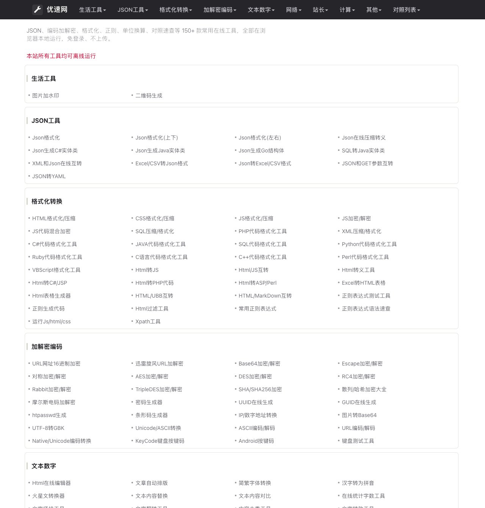
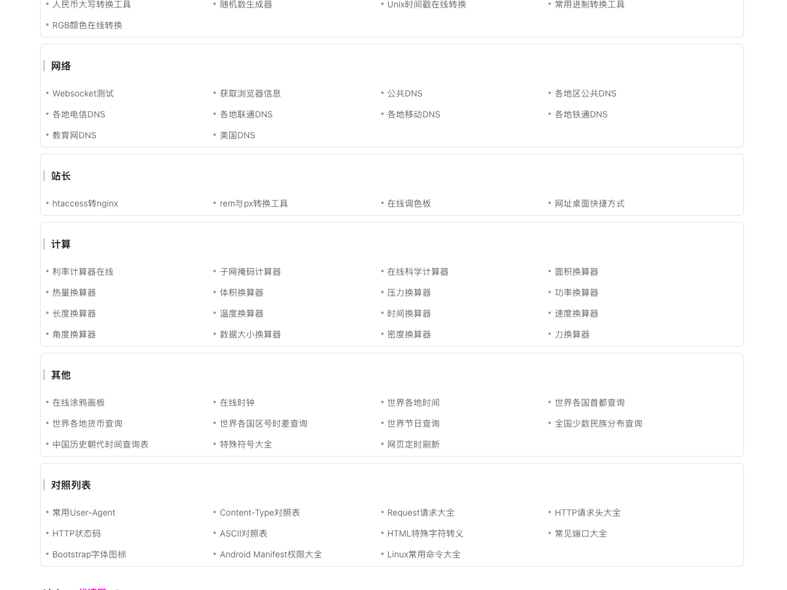

# uso.link

**English** | [中文](README.zh-CN.md)

A collection of 150+ everyday online tools: JSON, encode/decode, formatting, regex, unit conversion, lookup tables, and more. Everything runs locally in the browser, with no login and no uploads.

Live site: <https://uso.link>

## Run locally

Requires Go 1.22+.

```bash
git clone https://github.com/sysctl-date/uso.link.git
cd uso.link/cmd/web
go build .
./web
```

The server listens on `0.0.0.0:12345`. In production, put nginx in front to reverse-proxy 80/443.

## Screenshots




## Credits

HTML structure adapted from <https://hostloc.com/forum.php?mod=viewthread&tid=1351049>
